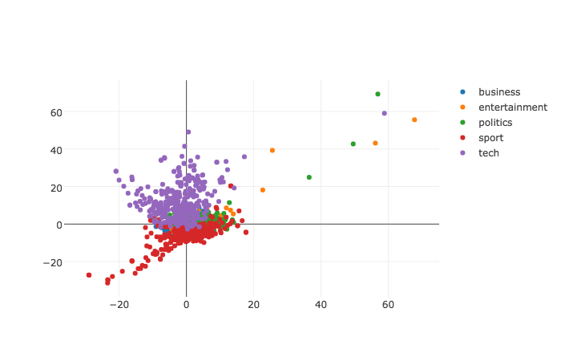

# jutsu-doc2vec-example

Clojure project meant to show an example of using jutsu for nlp tasks such as doc2vec.

# Usage

If you want to follow along with me after downloading the code here are the steps

I use an ubuntu server started up on digital ocean to get a fresh vm.

Download the news articles zip with:

`wget http://mlg.ucd.ie/files/datasets/bbc-fulltext.zip`

Then install unzip tool:
`sudo apt-get unzip`

```
mkdir articles
unzip bbc-fulltext.zip -d articles
```

Its important that you place all of the articles in the articles directory,
because later we will be able to point our word2vec model to that directory and it will load in all of the files.

Install git:
`sudo apt-get install git`

Download project:
`git clone https://github.com/hswick/jutsu-doc2vec-example.git`

Install java:

`sudo apt-get install default-jdk`

Install boot with this one liner bash command documented on the boot README

`sudo bash -c "cd /usr/local/bin && curl -fsSLo boot https://github.com/boot-clj/boot-bin/releases/download/latest/boot.sh && chmod 755 boot"`

You will need to create a boot.properties and set boot as root
`echo "BOOT_AS_ROOT=yes" > boot.properties`

Then you can verify boot is working by running `boot repl`

Exit out of the repl so we can start to setup our clojure project.

We can kickstart this process with one of my templates

`boot -d boot/new new -t boot-nightlight-template -n news-articles`

news-articles is the project name.

Run `echo "BOOT_AS_ROOT=yes" > boot.properties` in your project directory

Then connect to your remote machine it via ssh tunneling

`ssh -L 9002:localhost:4002 USERNAME@IP_ADDRESS`

Once you connect to the remote machine you should execute the code to generate the data:

`boot run`

Wait for that to complete and you should see news-articles-graph-data.json in your current directory.

Then open up the REPL to view our plots using the generated data.

```clojure
boot.user=> (require '[cheshire.core :as kitty])
nil
boot.user=> (def graph-data (kitty/parse-string (slurp "news-articles-graph-data.json")))
#'boot.user/graph-data
boot.user=> (require '[jutsu.core :as j])
nil
boot.user=> (j/start-jutsu! 4002 false)
Starting http-kit...
"http://localhost:4002/"
```

Connect to jutsu by opening up http://localhost:9002 in your browser.

Then execute the graph command in the repl for the plot to appear.
```
boot.user=> (j/graph! "News Articles" graph-data)
1
```
Your plot should look like this:


## Dev

Start up nightlight:

`boot night`

This will start nightlight on port 4000 which we can access on port 9000.

Type localhost:9000 in your browser (this may take a couple seconds to load).

Then connect to it via ssh tunneling

`ssh -L 9002:localhost:4002 USERNAME@IP_ADDRESS`


## License

Copyright © 2017 FIXME

Distributed under the Eclipse Public License either version 1.0 or (at
your option) any later version.
